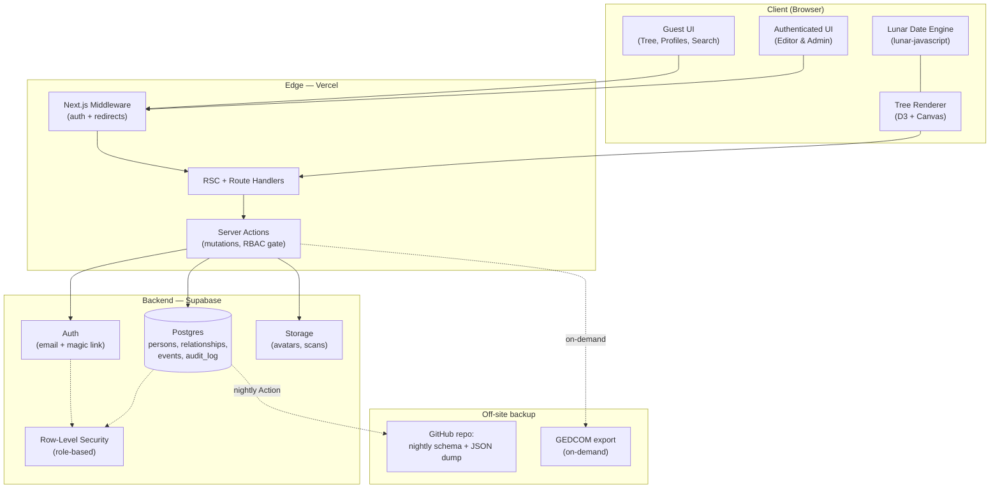
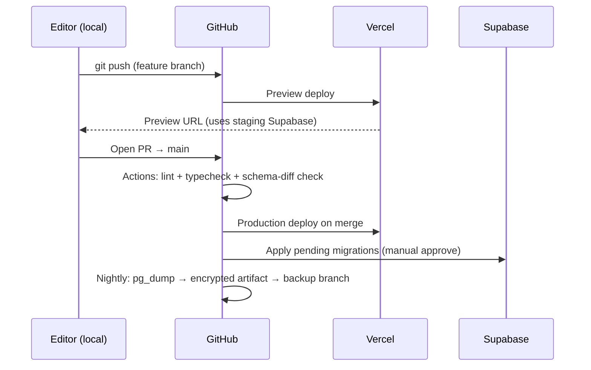
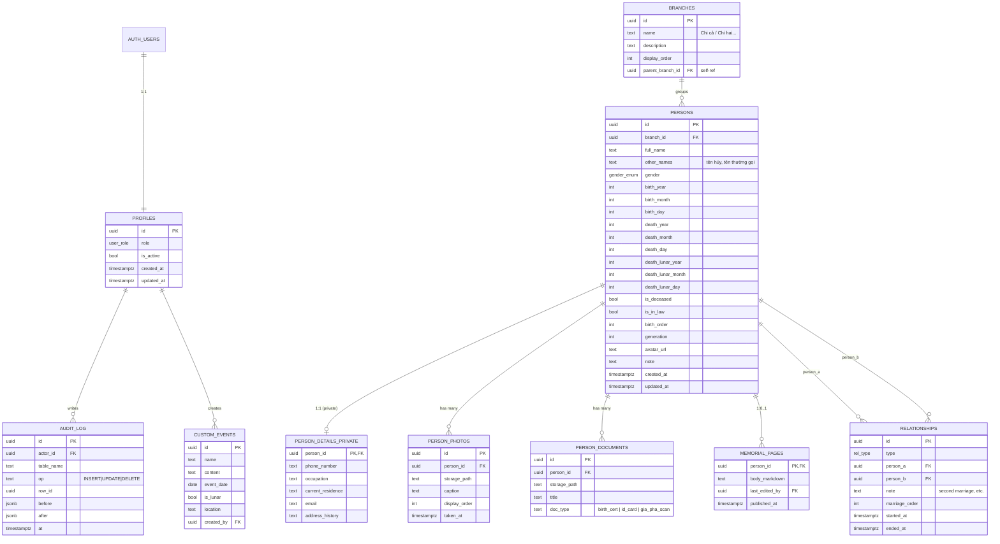

# Phan Tộc — Architecture Proposal

> **Project codename:** `phantoc`
> **Vietnamese name:** *Phan Tộc — Gia Phả Họ Phan*
> **English working title:** *The Phan Lineage — A Living Family Archive*
> **Audience:** A single Vietnamese family (surname **Phan / 潘**), private and self-hosted.
> **Status:** Architecture proposal, draft 1 of 2. This document covers Sections 1–5 (Vision → Kinship Engine). Sections 6–11 (UI/UX system, Tree visualization, Repo structure, Security, MVP roadmap, Future enhancements) follow in part 2.

---

## Naming & cultural anchor

The codename `phantoc` is the unaccented form of **Phan Tộc** (*Phan = the family name; tộc = clan / lineage*). The product wordmark uses the diacritic form, **Phan Tộc**, set in a serif designed for Vietnamese (full diacritic coverage). The subtitle **Gia Phả Họ Phan** ("the genealogy book of the Phan house") situates the app as a digital continuation of the gia phả tradition — the bound, ink-on-paper genealogy book that Vietnamese families have kept for centuries.

The Phan surname carries weight in Vietnamese cultural memory: Phan Bội Châu, Phan Châu Trinh, Phan Đình Phùng. The product's tone — restrained, archival, ceremonial — is calibrated to that lineage of seriousness, without naming any specific historical figure inside the app itself. The app is a **vessel**, not a museum about other Phans; it is an instrument for *this* family to deposit its own continuity.

### A specific lineage, not a generic "Vietnamese family"

This product is being built for a **specific, real chi tộc**: the **Phan clan of Cẩm Nê village, Đà Nẵng** (*Chi tộc Phan - làng Cẩm Nê, thành phố Đà Nẵng*). That specificity matters and is honored throughout the design:

- **Cẩm Nê** is a village in Hòa Vang district, ~100 km south of imperial Huế. The village is famous for **chiếu Cẩm Nê** — hand-woven sedge sleeping mats, a 500+ year craft once tributed to the Nguyễn court. The reed-weave (cói) lattice becomes a legitimate, specific motif for section dividers, loading shimmer textures, and the homepage backdrop — drawn from *this* family's craft heritage, not borrowed Vietnamese stock pattern.
- **Geography:** Cẩm Nê sits in Trung Bộ (central Vietnam). The Huế-imperial aesthetic the README calls for is *geographically authentic* here — not appropriation from a different region. The Phan family of Cẩm Nê lived next door to that imperial culture for centuries.
- **Linguistic register:** UI copy uses standard literary Vietnamese (the diction of gia phả books and the standard Bắc-influenced kinship vocabulary). Central-Vietnamese dialect is preserved in *content* the family enters (place names, transcribed quotes from elders) but not in *chrome*.

The first row of the `branches` table will not be a placeholder ("Chi cả"). It will be the real entity: **Chi tộc Phan - làng Cẩm Nê, thành phố Đà Nẵng, Việt Nam**. Every seed file, every example in this document, every demo screenshot uses that name. The product is rooted in a specific village from line 1.

---

# 1. Product Vision

## 1.1 Emotional philosophy

Phan Tộc is not a tool for productivity. It is an **act of keeping**. Most software optimizes for action — clicks, conversions, retention. Phan Tộc optimizes for *witness*: it asks the family to look, to remember, and to leave something legible to those who come after.

Three emotional invariants govern every design decision:

| Invariant | What it means in practice |
|---|---|
| **Stillness** | The interface never urges. No streaks, no badges, no "complete your profile" nags. Empty states are dignified, not pleading. |
| **Reverence** | Deceased members are visually treated with care — soft sepia tinting, a discreet 忌 (kỵ) marker on death anniversaries, never a strikethrough or grayed-out treatment that reads as "deactivated." |
| **Permanence** | Nothing in the database is hard-deleted by default. Edits leave audit trails. The family's history is *not* a CRUD app; it is closer to a ledger. |

## 1.2 User experience direction

The UX target is the **calm of a well-kept library** crossed with the **intimacy of a household altar (bàn thờ gia tiên)**. A guest opening the homepage should feel they have walked into a quiet room, not a dashboard.

Specific direction:

- **First contact (Guest):** Landing page presents a single quiet visual — a vertically scrolling lineage of names rendered in Playfair-style serif on warm parchment, with the family motto in chữ Hán (e.g. 潘氏家譜 / *Phan thị gia phả*) as a subtle wordmark. A single CTA: *Mở gia phả* (Open the genealogy).
- **Daily use (Editor):** Adding a new member should feel less like filling a form and more like inscribing a name. The form is calm, single-column, paged into emotional sections (*Tên gọi → Ngày tháng → Quan hệ → Câu chuyện*).
- **Annual rhythm:** The app surfaces upcoming **giỗ** (death anniversaries) on the homepage, computed from the lunar calendar — quietly, not as notifications.

## 1.3 Cultural identity

Phan Tộc draws from four wells, in this priority order:

1. **Gia phả book tradition** — vertical name columns, generation markers, paternal/maternal branch ink. This is the *primary* visual reference.
2. **Imperial Huế archives** — muted lacquer reds, ivory, deep ink black, gold leaf used sparingly as accents.
3. **Indochine villa interiors** — louvered shutters, terrazzo textures, warm lamp light. Informs spacing and "breathability."
4. **Đông Sơn motifs** — geometric drumhead patterns (concentric, rotational symmetry) used as section dividers and loading shimmer, never as decoration-for-decoration.

What we explicitly reject: dashboard chrome, gradient hero buttons, neon accents, glassmorphism, "fun" illustrations of cartoon families, generic SaaS empty states.

## 1.4 Long-term vision

Phan Tộc is built to outlive its first deployment. The horizon is **50 years**, not 5. That single constraint cascades into every other decision:

- **Data portability over feature lock-in.** GEDCOM export must work on day one. The app must be a *passable* gia phả even if Supabase ceases to exist.
- **Schema as heirloom.** The Postgres schema is treated as the durable artifact — the front-end will be rewritten three times before the schema is.
- **Self-hostable forever.** Zero proprietary services in the critical path. Supabase is replaceable with any Postgres + S3-compatible storage.
- **Read-mode without backend.** A static export of the tree (HTML + JSON) must be generatable, so a descendant in 2075 can open the family tree from a USB stick with no internet.

---

# 2. Recommended Architecture

## 2.1 System overview



## 2.2 Frontend architecture

**Framework:** Next.js 16 (App Router), React 19, TypeScript strict mode.

The frontend is split into three render contexts:

| Context | Used for | Why |
|---|---|---|
| **Server Components (RSC)** | Initial tree page, member detail, lineage views | Pulls from Supabase with the user's RLS context; zero JS shipped for read-only views. Critical for the Guest experience to feel instant. |
| **Client Components** | Tree pan/zoom, mindmap interaction, forms with progressive validation | Isolated to interactive islands. State stays local; no global Redux/Zustand. |
| **Server Actions** | All mutations (add member, edit relationship, upload avatar) | Co-located with the components that trigger them. Eliminates the API-route boilerplate that giapha-os already proves unnecessary. |

State management strategy:

- **No global store.** `DashboardContext` (mirroring the reference) holds in-flight UI state only. All durable state lives in Postgres.
- **`useOptimistic` + Server Actions** for member edits. The UI updates immediately; Server Action revalidates the path on settle.
- **URL is the source of truth** for view state — selected member, view mode (`tree | mindmap | timeline`), filters. Deep-linking and browser back-button work for free.

## 2.3 Backend architecture

**Backend pattern:** *Postgres-as-application-server*. Supabase exposes:

- **Auth** (email/password, magic link, optional OAuth Google later).
- **Postgres** with RLS as the *primary* authorization layer. Server Actions enforce a second gate (`getIsAdmin()` style) but RLS is the floor, so a leaked anon key cannot read private data.
- **Storage** for avatars and document scans, with bucket-level RLS mirroring the table policies.

We add three things on top of the giapha-os baseline:

1. **`audit_log` table** — every mutation through Server Actions writes a row (who, when, what, before/after). Admin-only readable. Append-only.
2. **`branches` table** — explicit clan branches (chi / nhánh), letting the family represent the structural splits that gia phả books traditionally enumerate ("chi cả," "chi hai," "chi ba"). Members reference a branch optionally; tree rendering can group/color by branch.
3. **`memorial_pages` table (V2)** — long-form biography, separate from `persons.note` because it's a different write pattern (rare, large, sometimes co-authored).

## 2.4 Authentication & authorization

Three roles, mapped to three real human relationships to the family:

| Role | Vietnamese | Authority | Real-world person |
|---|---|---|---|
| `admin` | Trưởng tộc / Người quản gia phả | Full read/write, RBAC, backups, restore, branch management | The family elder or designated keeper |
| `editor` | Người biên soạn | Add/edit members & relationships; cannot manage roles or restore | Adult relatives with verified context |
| `member` | Thành viên | Authenticated read; can comment on memorial pages (V2) | Any descendant with login |

The **Guest** tier is unauthenticated and gets a *redacted* view: full tree topology, names, generation/birth years, but no phone, no current residence, no occupation. This redaction is enforced by the `person_details_private` table separation (already in giapha-os) plus an additional `persons_public_view` Postgres view for guest endpoints.

First user to register becomes `admin` automatically (mirroring the reference). Subsequent registrations land as `member` and require admin promotion to become `editor`.

## 2.5 Hosting & infrastructure

Recommendation, with reasoning under §3:

| Layer | Service | Tier | Cost |
|---|---|---|---|
| Frontend (SSR + Edge) | **Vercel** | Hobby (or Pro if traffic > 100GB/mo) | Free → $20/mo |
| Database + Auth + Storage | **Supabase** | Free (500MB DB, 1GB storage) | Free for MVP |
| Domain | Cloudflare Registrar or Namecheap | — | ~$10/yr |
| Off-site backup | **GitHub private repo** + GitHub Actions | Free | Free |
| Email (auth + giỗ reminders V2) | **Resend** free tier | 100/day, 3000/mo | Free |

Total expected operational cost for the first ~3 years of family use: **$10–30 / year** (domain only). This satisfies the README's "low-cost / free hosting" mandate without compromising on stack quality.

## 2.6 CI/CD and deployment workflow



Branches:

- `main` → production, auto-deploys to Vercel.
- `dev` → staging, points at a separate Supabase staging project with seed data.
- Feature branches → preview deploys, share staging Supabase.

Schema migrations live in `supabase/migrations/` (numeric timestamp prefix, mirroring giapha-os's existing convention) and are applied via the Supabase CLI in CI with manual approval on production.

---

# 3. Tech Stack Comparison

The README requests structured comparisons across 16 candidates. They are grouped by layer below; final stack recommendation at §3.6.

## 3.1 Frontend framework

| Framework | Pros for Phan Tộc | Cons | Genealogy fit |
|---|---|---|---|
| **Next.js 16** | RSC eliminates client JS for read-only tree views; mature Vercel free tier; Server Actions remove API boilerplate; reference project already validates the pattern. | Locks us into Vercel-favored deployment (mitigatable via self-host); App Router has steeper learning curve. | ★★★★★ |
| **Nuxt 4** | Excellent DX; Vue's template ergonomics are kinder to non-React contributors. | Smaller ecosystem for graph viz (D3 + React Flow integrations are React-first); fewer Vietnamese-language tutorials in the React-Next mainstream. | ★★★★ |
| **SvelteKit** | Smallest bundle, fastest hydration, beautiful DX. | Smallest ecosystem of the four; no equivalent of React Flow at maturity; team rebuild cost if a contributor only knows React. | ★★★ |
| **Astro** | Best for content-heavy, mostly-static sites; ideal for the *guest* read view. | Interactive editor flows force a partial-hydration island story that is more complex than an integrated framework; the editor side becomes second-class. | ★★★ (guest-only) |
| **React (Vite SPA)** | Maximum flexibility. | Loses SSR/RSC benefits — guest first paint will be worse; adds backend boilerplate we don't need. | ★★ |
| **Vue (Vite SPA)** | Same flexibility, kinder template syntax. | Same SSR/SEO drawbacks as React-SPA; smaller graph viz ecosystem. | ★★ |

**Verdict:** **Next.js 16**. Validated by the reference, free hosting fits perfectly, RSC is genuinely the right paradigm for a read-heavy archive.

## 3.2 Database

| Option | Pros | Cons | Fit |
|---|---|---|---|
| **PostgreSQL (via Supabase)** | Recursive CTEs handle ancestor/descendant traversal cleanly; mature; portable; RLS gives us authz for free. | Graph traversal SQL is not as ergonomic as Cypher; very deep recursion (>20 generations) is slower than in a graph DB. | ★★★★★ |
| **Neo4j** | Cypher is purpose-built for kinship queries; visualization tools come bundled. | No realistic free tier for self-host with auth + UI; another service to operate; vendor risk; overkill for ≤10k nodes. | ★★★ |
| **Supabase (managed Postgres)** | Free tier; auth + storage + realtime out of the box; mirrors the reference exactly. | Free tier pauses after 7 days of inactivity (mitigated with a cron ping). | ★★★★★ |
| **Firebase / Firestore** | Generous free tier. | Document model is a poor fit for many-to-many kinship edges; no SQL → harder to migrate out; vendor lock-in is severe. | ★★ |
| **Prisma (ORM)** | Type-safe queries; great DX. | Adds a build step; ORMs hide the recursive CTEs that this domain genuinely benefits from; Supabase-generated types already cover 80% of the value. | ★★★ |

**Verdict:** **Postgres on Supabase, no ORM.** Use Supabase's generated TypeScript types directly. For traversal, write recursive CTEs as Postgres functions and call them via RPC (`supabase.rpc('get_ancestors', { person_id })`). This keeps the schema as the heirloom (§1.4) and the query language one layer thinner.

## 3.3 Styling & component layer

| Option | Pros | Cons | Fit |
|---|---|---|---|
| **Tailwind v4** | Reference already uses it; v4's CSS-first config + `@theme` directive lets us encode the heritage palette directly in CSS variables; zero runtime. | Class-heavy markup needs discipline. | ★★★★★ |
| **shadcn/ui** | Copy-in components, no runtime dependency, fully restyleable to match the heritage aesthetic. Critical: it is the *only* mainstream library that lets us achieve the museum aesthetic without fighting framework defaults. | Manual versioning; must own the components. | ★★★★★ |
| Headless UI / Radix | Excellent accessibility primitives (used by shadcn under the hood). | Lower-level; we'd reinvent shadcn. | ★★★★ (as dependency of shadcn) |
| Material UI / Chakra / Mantine | Comprehensive. | Their visual identity fights the heritage aesthetic; restyling is more work than starting from primitives. | ★ |

**Verdict:** **Tailwind v4 + shadcn/ui (Radix-based)** with a custom heritage theme.

## 3.4 Tree / graph visualization

| Option | Pros | Cons | Fit |
|---|---|---|---|
| **D3.js** | Reference already uses it; ultimate control over rendering; trivially supports custom hand-drawn layouts that look like a gia phả scroll. | Imperative API; we own layout & interaction. | ★★★★★ (primary) |
| **React Flow** | Best DX of the bunch; node/edge primitives are React components; pan/zoom and minimap built-in. | Default aesthetic is "flowchart"; styling away from that takes effort but is achievable; less suited to a vertical-scroll gia phả layout. | ★★★★ |
| **Cytoscape.js** | Best raw graph algorithms (community detection, shortest path); Canvas/WebGL renderer scales to 10k+ nodes. | API style is not React-idiomatic; aesthetic is engineering, not editorial. | ★★★ |
| **VisX** | D3 in React-friendly form; composable. | Less battle-tested than D3 directly for custom layouts. | ★★★ |
| **Custom Canvas** | Maximum perf; can render 50k nodes. | Months of work; not justified at our scale. | ★ |

**Verdict:** **D3 for the primary "Sơ đồ phả hệ" (gia phả scroll) view; React Flow for the secondary "Mindmap" view.** D3 because the *primary* visualization should not look like any other genealogy app — it should look like a gia phả book come alive. React Flow because the mindmap mode benefits from its built-in pan/zoom and node-component model, and the family will thank us for not maintaining two custom renderers.

## 3.5 Supporting libraries

| Need | Choice | Reason |
|---|---|---|
| Lunar dates (giỗ) | **lunar-javascript** | Reference uses it; battle-tested for Vietnamese/Chinese lunar conversion. |
| Animation | **Framer Motion** | Reference uses it; the only animation library that makes restraint easy (`AnimatePresence` + low spring tension). |
| Icons | **Lucide** | Already in reference; clean line weight matches the heritage aesthetic. |
| GEDCOM | **Custom (port from reference's `gedcom.ts`)** | The format is small enough to maintain in-house; external libs are GPL-encumbered or stale. |
| CSV/JSON I/O | **PapaParse + native JSON** | Reference uses it. |
| PDF export | **jsPDF + html-to-image** | For exporting the tree as a printable scroll. Reference uses it. |
| Forms | **React Hook Form + Zod** | New addition. Reference uses uncontrolled forms; for our depth (multiple marriages, partial dates) Zod schemas + RHF give better UX with less code. |

## 3.6 Final recommended stack

```
Runtime:        Bun (dev, install)            ←  faster than npm/pnpm
Framework:      Next.js 16 (App Router)
Language:       TypeScript 5 (strict)
UI:             React 19, Tailwind v4, shadcn/ui (Radix), Framer Motion, Lucide
Forms:          React Hook Form + Zod
Visualization:  D3.js (primary tree), React Flow (mindmap)
Lunar:          lunar-javascript
Database:       PostgreSQL via Supabase (no ORM)
Auth:           Supabase Auth (email + magic link)
Storage:        Supabase Storage
Backup:         GitHub Actions + private repo (encrypted nightly dumps)
Hosting:        Vercel (frontend) + Supabase (backend)
CI:             GitHub Actions (lint, typecheck, schema diff)
```

The stack is intentionally a *small superset* of giapha-os's stack. We keep what works, add what the heritage aesthetic demands (shadcn/ui, RHF+Zod), and accept zero new operational dependencies.

---

# 4. Database Design

## 4.1 ERD



## 4.2 Entities — what's new vs. giapha-os

| Entity | New / Inherited | Why |
|---|---|---|
| `profiles`, `persons`, `person_details_private`, `relationships`, `custom_events` | Inherited | Battle-tested; matches giapha-os schema. |
| `branches` | **New** | Vietnamese gia phả books group descendants into named "chi" (branches). For Phan Tộc the seed row is the real chi: *Chi tộc Phan - làng Cẩm Nê, thành phố Đà Nẵng, Việt Nam*. Storing this explicitly enables grouped/colored visualization and filtered exports. Self-referential so future sub-chi (when a generation splits into named sub-branches) attach to the parent. |
| `person_photos` | **New** | Reference stores only one `avatar_url`. Real families want photo galleries, especially for elders. Separate table avoids bloating `persons` and lets us paginate. |
| `person_documents` | **New** | Scans of original gia phả pages, birth/marriage certificates, ID cards. `doc_type` allows targeted UX (a gia phả scan is shown differently from an ID card). |
| `memorial_pages` | **New (V2)** | Long-form biography; separate write pattern from `persons.note` (rare, sometimes co-authored, may be markdown with images). |
| `audit_log` | **New** | Permanence (§1.4 invariant). Append-only, admin-readable. Powers a future "history" view. |
| `relationships.marriage_order`, `started_at`, `ended_at` | **New** | The README explicitly requires support for multiple marriages. `marriage_order` (1, 2, 3) drives visualization. `started_at` and `ended_at` are nullable to preserve the partial-information principle. |
| `custom_events.is_lunar` | **New** | Some events (giỗ) are inherently lunar. The flag tells the rendering layer which calendar to anchor to. |

## 4.3 SQL — additions on top of giapha-os schema

Below is the *delta* from `reference_source/giapha-os/docs/schema.sql`. Existing tables stay as-is.

```sql
-- ── BRANCHES ──────────────────────────────────────────────
CREATE TABLE IF NOT EXISTS public.branches (
  id UUID DEFAULT gen_random_uuid() PRIMARY KEY,
  name TEXT NOT NULL,
  description TEXT,
  display_order INT NOT NULL DEFAULT 0,
  parent_branch_id UUID REFERENCES public.branches(id) ON DELETE SET NULL,
  created_at TIMESTAMPTZ DEFAULT NOW(),
  updated_at TIMESTAMPTZ DEFAULT NOW()
);
CREATE INDEX idx_branches_parent ON public.branches(parent_branch_id);

ALTER TABLE public.persons
  ADD COLUMN IF NOT EXISTS branch_id UUID REFERENCES public.branches(id) ON DELETE SET NULL;
CREATE INDEX idx_persons_branch ON public.persons(branch_id);

-- ── PERSON_PHOTOS ─────────────────────────────────────────
CREATE TABLE IF NOT EXISTS public.person_photos (
  id UUID DEFAULT gen_random_uuid() PRIMARY KEY,
  person_id UUID NOT NULL REFERENCES public.persons(id) ON DELETE CASCADE,
  storage_path TEXT NOT NULL,
  caption TEXT,
  display_order INT NOT NULL DEFAULT 0,
  taken_at TIMESTAMPTZ,
  uploaded_by UUID REFERENCES public.profiles(id),
  created_at TIMESTAMPTZ DEFAULT NOW()
);
CREATE INDEX idx_person_photos_person ON public.person_photos(person_id, display_order);

-- ── PERSON_DOCUMENTS ──────────────────────────────────────
CREATE TYPE public.doc_type_enum AS ENUM (
  'birth_certificate', 'death_certificate', 'marriage_certificate',
  'id_card', 'gia_pha_scan', 'other'
);
CREATE TABLE IF NOT EXISTS public.person_documents (
  id UUID DEFAULT gen_random_uuid() PRIMARY KEY,
  person_id UUID NOT NULL REFERENCES public.persons(id) ON DELETE CASCADE,
  storage_path TEXT NOT NULL,
  title TEXT,
  doc_type public.doc_type_enum NOT NULL DEFAULT 'other',
  uploaded_by UUID REFERENCES public.profiles(id),
  created_at TIMESTAMPTZ DEFAULT NOW()
);

-- ── MEMORIAL_PAGES (V2) ───────────────────────────────────
CREATE TABLE IF NOT EXISTS public.memorial_pages (
  person_id UUID PRIMARY KEY REFERENCES public.persons(id) ON DELETE CASCADE,
  body_markdown TEXT NOT NULL,
  last_edited_by UUID REFERENCES public.profiles(id),
  published_at TIMESTAMPTZ,
  created_at TIMESTAMPTZ DEFAULT NOW(),
  updated_at TIMESTAMPTZ DEFAULT NOW()
);

-- ── RELATIONSHIPS — extended ─────────────────────────────
ALTER TABLE public.relationships
  ADD COLUMN IF NOT EXISTS marriage_order INT,
  ADD COLUMN IF NOT EXISTS started_at DATE,
  ADD COLUMN IF NOT EXISTS ended_at DATE;

-- ── CUSTOM_EVENTS — lunar flag ───────────────────────────
ALTER TABLE public.custom_events
  ADD COLUMN IF NOT EXISTS is_lunar BOOLEAN NOT NULL DEFAULT FALSE;

-- ── AUDIT_LOG ─────────────────────────────────────────────
CREATE TABLE IF NOT EXISTS public.audit_log (
  id UUID DEFAULT gen_random_uuid() PRIMARY KEY,
  actor_id UUID REFERENCES public.profiles(id),
  table_name TEXT NOT NULL,
  op TEXT NOT NULL CHECK (op IN ('INSERT','UPDATE','DELETE')),
  row_id UUID,
  before JSONB,
  after JSONB,
  at TIMESTAMPTZ NOT NULL DEFAULT NOW()
);
CREATE INDEX idx_audit_log_actor ON public.audit_log(actor_id, at DESC);
CREATE INDEX idx_audit_log_row ON public.audit_log(table_name, row_id, at DESC);

-- Append-only enforcement
REVOKE UPDATE, DELETE ON public.audit_log FROM authenticated;

-- Generic audit trigger
CREATE OR REPLACE FUNCTION public.fn_audit() RETURNS TRIGGER AS $$
BEGIN
  INSERT INTO public.audit_log(actor_id, table_name, op, row_id, before, after)
  VALUES (
    auth.uid(),
    TG_TABLE_NAME,
    TG_OP,
    COALESCE(NEW.id, OLD.id),
    CASE WHEN TG_OP IN ('UPDATE','DELETE') THEN to_jsonb(OLD) END,
    CASE WHEN TG_OP IN ('INSERT','UPDATE') THEN to_jsonb(NEW) END
  );
  RETURN COALESCE(NEW, OLD);
END;
$$ LANGUAGE plpgsql SECURITY DEFINER;

CREATE TRIGGER tr_audit_persons       AFTER INSERT OR UPDATE OR DELETE ON public.persons       FOR EACH ROW EXECUTE FUNCTION public.fn_audit();
CREATE TRIGGER tr_audit_relationships AFTER INSERT OR UPDATE OR DELETE ON public.relationships FOR EACH ROW EXECUTE FUNCTION public.fn_audit();
CREATE TRIGGER tr_audit_branches      AFTER INSERT OR UPDATE OR DELETE ON public.branches      FOR EACH ROW EXECUTE FUNCTION public.fn_audit();
```

## 4.4 Genealogy traversal — Postgres functions

Rather than pulling the entire graph into the client (giapha-os does this and it works fine at <10k nodes), we expose two recursive CTEs as RPC functions for cases where partial loading matters (mobile, large trees in V2):

```sql
-- All ancestors of a person, with depth
CREATE OR REPLACE FUNCTION public.get_ancestors(p_id UUID, max_depth INT DEFAULT 20)
RETURNS TABLE(person_id UUID, depth INT) AS $$
  WITH RECURSIVE anc AS (
    SELECT r.person_a AS person_id, 1 AS depth
    FROM public.relationships r
    WHERE r.person_b = p_id AND r.type IN ('biological_child','adopted_child')
    UNION ALL
    SELECT r.person_a, a.depth + 1
    FROM anc a
    JOIN public.relationships r ON r.person_b = a.person_id
    WHERE r.type IN ('biological_child','adopted_child') AND a.depth < max_depth
  )
  SELECT * FROM anc;
$$ LANGUAGE sql STABLE;

-- All descendants of a person
CREATE OR REPLACE FUNCTION public.get_descendants(p_id UUID, max_depth INT DEFAULT 20)
RETURNS TABLE(person_id UUID, depth INT) AS $$
  WITH RECURSIVE desc AS (
    SELECT r.person_b AS person_id, 1 AS depth
    FROM public.relationships r
    WHERE r.person_a = p_id AND r.type IN ('biological_child','adopted_child')
    UNION ALL
    SELECT r.person_b, d.depth + 1
    FROM desc d
    JOIN public.relationships r ON r.person_a = d.person_id
    WHERE r.type IN ('biological_child','adopted_child') AND d.depth < max_depth
  )
  SELECT * FROM desc;
$$ LANGUAGE sql STABLE;
```

These functions are `SECURITY INVOKER` (default for `LANGUAGE sql`) so they respect RLS automatically. No new permission surface.

## 4.5 Indexes & traversal performance

The reference's indexes (on `relationships.person_a`, `person_b`, `type`) are sufficient for trees under ~5k members. For Phan Tộc we add:

```sql
CREATE INDEX idx_relationships_pair ON public.relationships(person_a, person_b, type);
CREATE INDEX idx_persons_generation_branch ON public.persons(generation, branch_id);
CREATE INDEX idx_persons_birth_year ON public.persons(birth_year) WHERE birth_year IS NOT NULL;
```

Expected query budget for the hot path (full tree load on dashboard): **< 50ms** at 1k members, **< 200ms** at 5k. We will add `EXPLAIN ANALYZE` checks to CI once the seed exceeds 500 members.

## 4.6 Media model

Avatars and document scans live in two Supabase Storage buckets:

| Bucket | Public? | RLS rule |
|---|---|---|
| `avatars/` | Public-read | Write: `is_admin() OR is_editor()`. Filename: `{person_id}-{uuid}.{ext}`. |
| `documents/` | **Private** | Read & write: `is_admin()` only. Signed URLs (5 min TTL) for editor view. |

Storage paths are stored in `person_photos.storage_path` and `person_documents.storage_path` rather than full URLs, so swapping the storage backend later is a one-line change in the URL builder.

## 4.7 Audit & event system

Every mutation through Server Actions creates an `audit_log` row via the trigger in §4.3. Reads of the audit log are admin-only (RLS). Two views derived from it:

- `v_recent_changes` — last 50 mutations, for the admin dashboard.
- `v_member_history(person_id)` — full edit history for one person, surfaced on the member detail page as "Lịch sử chỉnh sửa."

## 4.8 Prisma alternative (rejected, briefly justified)

The README lists Prisma as a candidate. We reject it because:

1. Supabase already generates TypeScript types from the schema (`supabase gen types typescript`).
2. The recursive CTEs in §4.4 are hostile to ORM ergonomics; we'd end up using `prisma.$queryRaw` for the most important queries anyway.
3. Adding Prisma is a 30MB / 200ms cold-start tax on Vercel functions.

ORM-style ergonomics are unnecessary at this scale. Direct Supabase JS client + generated types is enough.

---

# 5. Vietnamese Kinship Resolution Engine

## 5.1 Problem statement

Given two members `A` and `B` and the family graph, output:

1. What `A` calls `B` (`aCallsB`) — e.g. *"Bác họ"*
2. What `B` calls `A` (`bCallsA`) — e.g. *"Cháu họ"*
3. A human-readable description of the relationship path
4. The numeric distance (sum of generations from each to the LCA)
5. Step-by-step labels of the path

The rules are not symmetric, not derivable from a single distance, and depend on six dimensions:

- **Gender** of A and B
- **Relative seniority** (older / younger sibling matters: *anh* vs *em*)
- **Paternal vs maternal side** (*nội* vs *ngoại*) — determined by the gender of the *branch person* (the child of the LCA on either side)
- **Generation depth** from the lowest common ancestor (LCA)
- **Marriage hops** — A→B may pass through one or both spouses (yielding *con dâu*, *anh em cột chèo*, *chị em dâu*…)
- **Relationship type** — biological vs adopted vs in-law (`is_in_law` flag)

## 5.2 Algorithm overview

The reference's `computeKinship` (`reference_source/giapha-os/utils/kinshipHelpers.ts:382`) is an excellent baseline. We adopt it as v1 of the engine, with three structural improvements documented below.

### Baseline pipeline (inherited)

```
1. If A == B: return null.
2. Build parentMap (child → [parents]) and spouseMap (person → [spouses]) from edges.
3. If A and B are spouses: return ("Vợ"/"Chồng", "Vợ"/"Chồng", "Hôn nhân").
4. findBloodKinship(A, B):
     a. BFS ancestors of A → ancA: Map<id, {depth, path}>
     b. BFS ancestors of B → ancB
     c. Find LCA = id minimizing (ancA[id].depth + ancB[id].depth)
     d. resolveBloodTerms(depthA, depthB, A, B, pathA, pathB)
5. If no blood path: try spousesOf(A) → blood-path → wrap with marriage suffix
6. Else try spousesOf(B) → wrap
7. Else try (spouseA, spouseB) pairs → wrap with double marriage
```

`resolveBloodTerms` is a case lattice over `(depthA, depthB)`:

| `(depthA, depthB)` | Meaning | Term family |
|---|---|---|
| `(0, n)` | A is the LCA, B is descendant | Bố/Mẹ → Ông/Bà → Cụ → Kỵ → Sơ |
| `(n, 0)` | B is the LCA, A is descendant | Con → Cháu → Chắt → Chít |
| `(1, 1)` | Full siblings | Anh/Chị/Em (gendered, seniority-ordered) |
| `(>1, 1)` | B is sibling of A's ancestor | Bác / Chú / Cô / Cậu / Dì (with paternal/maternal switch) |
| `(>1, >1, equal)` | Cousins | Anh/Chị/Em họ |
| `(>1, >1, ≠)` | Generation-skewed cousins | Bác họ / Cô họ / Chú họ / Cậu họ / Dì họ + descendants flip |

Marriage wrapping appends suffixes like ` vợ`, ` chồng`, transforms *Con* → *Con dâu* / *Con rể*, *Anh trai* → *Anh rể*, etc. Reference `kinshipHelpers.ts:436-512` enumerates 30+ specific transforms; we keep them.

## 5.3 Improvements over the reference

### 5.3.1 Adoption-aware blood path

The reference treats `biological_child` and `adopted_child` identically when finding the LCA. Cultural reality is more nuanced: in many Vietnamese families adopted children *are* called the standard kin terms, but some families track this. We add a flag:

```ts
computeKinship(A, B, persons, relationships, {
  treatAdoptionAsBlood: true,  // default: true
  preferShorterAdoptedPath: false,
})
```

When `treatAdoptionAsBlood: false`, the BFS only follows `biological_child` edges, and the description appends "(qua nhận nuôi)" if the only path is via adoption.

### 5.3.2 Affinity disambiguation when both spouses match

If A→B can be reached via both `spousesOf(A)` and `spousesOf(B)`, the reference returns the first match. We rank the candidates and return the *closest* one (smallest total `distance`) with a tie-break on "fewer marriage hops." This eliminates a class of confusing results in families with cross-marriages.

### 5.3.3 In-law transitivity cap

The reference will follow *any* spouse chain, which can produce nonsense terms like "Chồng của Cháu họ của Vợ" (spouse-of-cousin-of-spouse). We cap marriage hops at **2** (already the practical limit in the existing code; we make it a named constant `MAX_MARRIAGE_HOPS = 2`) and return `"Người trong họ"` (a generic but dignified term) when no path is found within budget.

## 5.3.4 Result shape — extended

```ts
export interface KinshipResult {
  aCallsB: string;
  bCallsA: string;
  description: string;
  distance: number;
  pathLabels: string[];
  // additions
  side: "paternal" | "maternal" | "marital" | "self";  // Nội / Ngoại / Bên vợ-chồng / —
  certainty: "certain" | "ambiguous" | "fallback";     // for UI tone
  ancestorId: string | null;                           // LCA, for "view shared ancestor" link
}
```

`certainty: "fallback"` triggers the UI to display *"Chưa xác định — vui lòng kiểm tra dữ liệu quan hệ"* with the same calm tone as the rest of the app, never an error icon.

## 5.4 Pseudo-code (canonical form)

```
function computeKinship(A, B, persons, rels, opts = {}):
  if A.id == B.id: return null

  parentMap, spouseMap = buildAdjacency(persons, rels, opts)

  if isSpouse(A, B, spouseMap):
    return marriageResult(A, B)

  blood = findBloodKinship(A, B, parentMap)
  if blood: return blood

  // Through A's spouse
  for sA in spousesOf(A):
    if sA == B: continue
    res = findBloodKinship(sA, B, parentMap)
    if res:
      candidates.push(wrapWithMarriageOnA(res, A, sA))

  // Through B's spouse
  for sB in spousesOf(B):
    res = findBloodKinship(A, sB, parentMap)
    if res:
      candidates.push(wrapWithMarriageOnB(res, B, sB))

  // Through both spouses (special: cột chèo, chị em dâu)
  for sA in spousesOf(A), sB in spousesOf(B):
    if sA == sB: continue
    res = findBloodKinship(sA, sB, parentMap)
    if res:
      candidates.push(wrapWithDoubleMarriage(res, A, sA, B, sB))

  return rankCandidates(candidates) ?? fallbackResult()


function findBloodKinship(A, B, parentMap):
  ancA = bfsAncestors(A, parentMap)   // Map<id, {depth, path}>
  ancB = bfsAncestors(B, parentMap)

  lca, dA, dB = findLCA(ancA, ancB)   // minimize dA + dB
  if !lca: return null

  branchA = ancA[lca].path.last       // child of LCA on A's side
  branchB = ancB[lca].path.last       // child of LCA on B's side
  isPaternalA = branchA.gender == "male"   // A's view of the connection

  return resolveBloodTerms(dA, dB, A, B, branchA, branchB, isPaternalA)


function bfsAncestors(start, parentMap):
  // Standard BFS, queue of {id, depth, path}, visited set.
  // path collects intermediate PersonNodes (not including start, not including target ancestor).
  // Returns Map<ancestorId, {depth, path}>


function rankCandidates(cands):
  // Sort by:
  // 1. fewer marriage hops (0 < 1 < 2)
  // 2. smaller distance
  // 3. higher certainty
  return cands.sort(compare).first
```

## 5.5 Worked example

Family fragment:

```
                Phan Văn Tổ (m, gen 1)  ──┬── Lê Thị Lan (f, gen 1)
                                          │
            ┌─────────────────────────────┼─────────────────────────────┐
            │                             │                             │
   Phan Văn Bình (m, gen 2)    Phan Thị Cúc (f, gen 2)        Phan Văn Đức (m, gen 2)
   ──┬── Trần Thị Hoa                                          ──┬── Vũ Thị Mai
     │                                                          │
   Phan Minh An (m, gen 3, 1985)                              Phan Thanh Hà (f, gen 3, 1990)
```

Query: `computeKinship(An, Hà)`.

Trace:
- `An` and `Hà` are not spouses.
- `bfsAncestors(An)`: `{An:0, Bình:1, Tổ:2, Lan:2}`
- `bfsAncestors(Hà)`: `{Hà:0, Đức:1, Tổ:2, Lan:2}`
- `LCA = Tổ`, `dA = 2`, `dB = 2`.
- `branchA = Bình` (m) → `isPaternalA = true` → side = "paternal"
- `branchB = Đức` (m). Both male children of LCA → both paternal-side.
- `(depthA == depthB == 2)` → cousins.
- `compareSeniority(Bình, Đức)`: same generation, `Bình.birth_order < Đức.birth_order` → `Bình` is senior → `An`'s branch is senior.
- Result:
  - `aCallsB` = *"Em họ"* (An is older-branch, Hà is younger-branch)
  - `bCallsA` = *"Anh họ"* (since An is male, branch-senior)
  - `description` = *"Anh em họ Nội (Tổ tiên chung: Phan Văn Tổ)"*
  - `side` = `"paternal"`
  - `certainty` = `"certain"`

## 5.6 Complexity analysis

Let `N` = number of persons, `E` = number of relationship edges, `D` = max generation depth.

| Step | Time | Space |
|---|---|---|
| Build `parentMap`, `spouseMap` | `O(E)` | `O(E)` |
| BFS ancestors of A | `O(D)` (linear in ancestors, ≤ 2^D in pathological cases but realistically `D ≤ 20`) | `O(D)` |
| BFS ancestors of B | `O(D)` | `O(D)` |
| Find LCA | `O(min(\|ancA\|, \|ancB\|))` | — |
| `resolveBloodTerms` | `O(1)` (case lattice) | `O(1)` |
| Marriage wrapping (worst case 2 hops) | `O(S^2)` where `S` = avg spouses per person (≈ 1.05 in practice) | `O(S^2)` |
| **Total `computeKinship`** | **`O(E + D + S^2)`** | **`O(E)`** |

For Phan Tộc's expected scale (`N ≤ 5,000`, `E ≤ 15,000`, `D ≤ 12`, `S ≈ 1.05`), every kinship query completes in **< 5 ms** in the browser. No backend round-trip needed; the engine runs entirely client-side after one initial graph fetch.

## 5.7 Edge cases & how they're handled

| Edge case | Handling |
|---|---|
| Unknown parents for a member | The member is a "rooted" node; `findBloodKinship` simply doesn't find them as descendant of any LCA. Returns fallback. |
| Multiple marriages | All spouses appear in `spouseMap`; the wrapping iteration tries each. Distance ranking picks the closest blood path through any of them. |
| Cycle in the data (data error) | BFS uses a `visited` set keyed by id; no infinite loop. We additionally log a warning when a cycle is detected so admins can fix the data. |
| Half-siblings | Two children sharing only one parent. The LCA is that single shared parent at `depth=1` from each. Result: *Anh/Em cùng cha khác mẹ* — handled by extending `resolveBloodTerms` with a check on `pathA[last].id == pathB[last].id` (full siblings) vs not (half siblings). **This is a v1.1 enhancement; the reference does not currently distinguish.** |
| Adoption | See §5.3.1. |
| In-law adding (e.g. *Con dâu*'s parents) | These appear in the family graph only if the family explicitly adds them; if added, the engine handles them via the standard double-marriage path. |
| Identical names across generations | Names are display-only; the engine works on UUIDs. |

## 5.8 Future scalability

For families exceeding 50k members (well beyond Phan Tộc's horizon, but useful for the architecture spec):

- Move `computeKinship` to a Postgres function using recursive CTEs + a stored term-resolution table. RPC call replaces client computation.
- Pre-compute and cache `(personA, personB) → result` for the top 1% most-queried pairs (typically pairs involving the family head).
- Store the `parentMap` BFS results in IndexedDB on the client with a schema-version key; invalidate on schema migration or on any `relationships` table mutation observed via Supabase Realtime.

None of these are needed for MVP.

---

# 6. UI/UX Design System

## 6.1 Design philosophy in two sentences

The interface is a **modern editorial book**, not a dashboard. Every choice — typography, palette, motion, spacing — exists to make the family feel they are turning the pages of a well-cared-for object, not navigating an app.

## 6.2 Typography system

Vietnamese has heavy diacritic stacking (â, ấ, ậ, ằ, ễ, ợ, ỹ…). Many fonts that look beautiful in Latin betray themselves with poorly placed marks. We use only fonts with **explicit Vietnamese subsets** and verified diacritic positioning.

| Role | Font | Rationale |
|---|---|---|
| **Display / wordmark** | **Cormorant Garamond** (700) | Refined Garalde with elongated ascenders; the wordmark *Phan Tộc* renders with restraint and weight. Has a `vietnamese` subset. |
| **Section headings** | **Playfair Display** (600) | Inherited from giapha-os; high-contrast didone ductus complements gia phả book aesthetic. Used at H2/H3, not H1. |
| **Body** | **Inter** (400/500) | Inherited; the most diacritic-correct sans available; high x-height = readability for elders. |
| **Numerics & dates** | **Inter** with `tabular-nums` | Birth/death years align in tables. |
| **Mono / IDs** | **JetBrains Mono** (admin views only) | For audit log timestamps and UUIDs. |
| **Vietnamese seal / chữ Hán accent** | **Noto Serif TC** (300) | For the optional 潘氏家譜 seal mark on the homepage. Loaded only on the landing page. |

Type scale (modular, ratio 1.25 — *Major Third*):

```
display    → 4.768rem   (76 px)   — homepage wordmark only
h1         → 3.815rem   (61 px)   — never on dashboards; landing only
h2         → 3.052rem   (49 px)
h3         → 2.441rem   (39 px)
h4         → 1.953rem   (31 px)
h5         → 1.563rem   (25 px)
body-lg    → 1.25rem    (20 px)   — member detail body
body       → 1rem       (16 px)
body-sm    → 0.8rem     (13 px)
caption    → 0.64rem    (10 px)   — used sparingly; metadata only
```

Line-heights skew generous: `body` = 1.7, `h2/h3` = 1.2. The README's "breathable" mandate translates literally into vertical rhythm.

## 6.3 Color palette — *Lụa & Sơn Mài* (Silk & Lacquer)

Six colors and their tints. No more. Restraint is the entire point.

| Token | Hex | Role | Inspiration |
|---|---|---|---|
| `--ink` | `#1A1714` | Primary text, branches in tree | Mực tàu (Chinese ink stick) |
| `--parchment` | `#F4ECDC` | Default background | Aged gia phả paper |
| `--parchment-warm` | `#EAE0CB` | Card background | Older parchment |
| `--lacquer` | `#7A1F2C` | Primary action, generation markers | Sơn mài đỏ (Vietnamese lacquer red) |
| `--lacquer-deep` | `#4A1119` | Hover state of `--lacquer`; ceremonial accents | Aged lacquer |
| `--gold` | `#A8843E` | Generation N labels, family seal accents | Vàng kim hoàng cung (imperial gold) — used in <2% of UI |
| `--sage` | `#5C6B4F` | Living member indicator (subtle) | Lá chuối khô (dried banana leaf) |
| `--sepia` | `#8B7355` | Deceased member indicator (subtle) | Old photo sepia |
| `--ivory` | `#FBF7EE` | Modal/sheet backgrounds | Ngà voi cũ |
| `--shadow` | `rgba(26,23,20,0.08)` | Card elevation; never harder | Soft daylight shadow |

**Dark mode** (the README calls it "heritage modes" — we name them):

| Mode | Background | Text | Accent |
|---|---|---|---|
| `light` (default — *Ban Ngày*, "daytime") | `--parchment` | `--ink` | `--lacquer` |
| `dark` (*Đêm Trầm*, "deep night") | `#13110E` | `#EFE6D2` | `#A03B49` (lacquer brightened) |

Dark mode is calibrated to feel like reading by an oil lamp, not like a code editor. We deliberately avoid pure black backgrounds.

## 6.4 Tailwind v4 token configuration

Tailwind v4 takes its theme from CSS — so we declare tokens once, in `app/globals.css`, and use them everywhere.

```css
/* app/globals.css */
@import "tailwindcss";

@theme {
  /* Fonts */
  --font-display: "Cormorant Garamond", "Playfair Display", serif;
  --font-serif:   "Playfair Display", Georgia, serif;
  --font-sans:    "Inter", "Helvetica Neue", system-ui, sans-serif;
  --font-mono:    "JetBrains Mono", ui-monospace, monospace;

  /* Color tokens — light mode default */
  --color-ink:             #1A1714;
  --color-parchment:       #F4ECDC;
  --color-parchment-warm:  #EAE0CB;
  --color-lacquer:         #7A1F2C;
  --color-lacquer-deep:    #4A1119;
  --color-gold:            #A8843E;
  --color-sage:            #5C6B4F;
  --color-sepia:           #8B7355;
  --color-ivory:           #FBF7EE;

  /* Spacing — 8px base, generous rhythm */
  --spacing-rhythm-1: 0.5rem;   /*  8 */
  --spacing-rhythm-2: 1rem;     /* 16 */
  --spacing-rhythm-3: 1.5rem;   /* 24 */
  --spacing-rhythm-4: 2.5rem;   /* 40 */
  --spacing-rhythm-5: 4rem;     /* 64 */
  --spacing-rhythm-6: 6.5rem;   /* 104 */

  /* Radii — soft, never sharp */
  --radius-paper: 2px;          /* book pages */
  --radius-card:  6px;
  --radius-pill:  9999px;

  /* Motion */
  --ease-page:    cubic-bezier(0.22, 1, 0.36, 1);  /* slow out, like flipping a page */
  --duration-page: 600ms;
  --duration-fade: 280ms;
}

@media (prefers-color-scheme: dark) {
  :root[data-theme="auto"], :root[data-theme="dark"] {
    --color-ink:            #EFE6D2;
    --color-parchment:      #13110E;
    --color-parchment-warm: #1B1814;
    --color-lacquer:        #A03B49;
    --color-ivory:          #1B1814;
  }
}
```

Tokens are then used directly: `bg-parchment`, `text-ink`, `border-lacquer/30`, `font-display`, `duration-page`.

## 6.5 Motion design

Animation rules:

1. **No motion ever for decoration.** Motion conveys state change (page turn, expand, focus) — never "delight."
2. **Slow easing, never bounce.** `--ease-page` (cubic-bezier(0.22, 1, 0.36, 1)) is the default; springs are reserved for tree node expand/collapse with low tension (`stiffness: 110, damping: 22`).
3. **Ambient motion is forbidden.** No floating particles, no auto-playing carousels, no marquee.
4. **`prefers-reduced-motion: reduce`** disables all non-essential motion, including tree expansion springs (replaced by 0ms instant).

Motion vocabulary:

| Pattern | Used for | Spec |
|---|---|---|
| **Page turn** | Route transitions on the public site | Opacity 0→1 + Y translate 12px→0 over `--duration-page` with `--ease-page`. |
| **Inscribe** | New member added to tree | Fade in + draw the connecting line via `pathLength` (Framer Motion) over 800ms. |
| **Lift** | Card hover / focus | `box-shadow` from `0 1px 0 var(--shadow)` to `0 4px 14px var(--shadow)`, no scale. |
| **Reveal** | Modal / sheet entrance | Backdrop fade + sheet Y-translate 24→0 over `--duration-fade`. |
| **Branch fold** | Subtree collapse | Children fade out + height collapse, 320ms; reverse on expand. |

## 6.6 Component hierarchy

Component layer cake (top to bottom):

```
┌──────────────────────────────────────────────────┐
│  Pages          (app/.../page.tsx)               │  composes layouts + features
├──────────────────────────────────────────────────┤
│  Features       (components/features/*)          │  domain-aware (MemberDetail, KinshipFinder)
├──────────────────────────────────────────────────┤
│  Patterns       (components/patterns/*)          │  cross-feature (PersonCard, BranchBadge)
├──────────────────────────────────────────────────┤
│  Primitives     (components/ui/*)                │  shadcn-derived; Button, Dialog, Input…
├──────────────────────────────────────────────────┤
│  Tokens         (globals.css @theme)             │  CSS variables only
└──────────────────────────────────────────────────┘
```

Rules:

- A primitive never imports from a higher layer.
- A pattern never imports a feature.
- Pages may import from any layer.
- Anything that is *visual but not interactive* lives in `components/visual/` and contains only SVG/Canvas (the reed-weave divider, the seal, the parchment texture).

## 6.7 Iconography

Lucide, stroke 1.5px (slightly thinner than default 2px to match the Garalde type weight). Icons are *never* used as decoration — only as functional indicators next to interactive elements. Custom icons are reserved for three concepts that Lucide cannot express:

| Custom icon | Use |
|---|---|
| **Reed seal** | Family seal, used once per page max |
| **Generation marker** | A small Hán numeral (一, 二, 三…) for generation labels in the tree |
| **Giỗ flame** | A spare line drawing of an oil lamp; used on death anniversary dates |

## 6.8 Texture & imagery strategy

Three textures, used at low opacity (`8–14%`):

1. **Parchment grain** — a 4096×4096 SVG noise filter, applied to body backgrounds via `background-image: url("/textures/parchment.svg")`.
2. **Reed-weave (chiếu Cẩm Nê)** — a tessellated SVG pattern (1cm×1cm tile). The lattice references the family's home village's craft. Used as section dividers between major content blocks and as a subtle backdrop on the homepage hero. **This is the family-specific motif.**
3. **Đông Sơn rosette** — concentric geometric rings drawn in `--gold`. Used once per page maximum, as the loading shimmer on long imports.

Photographs of family members are presented with a `1px var(--ink) / 0.25` border, no shadow, on a `--parchment-warm` mat — the visual language of an actual photograph in a leather album.

## 6.9 Accessibility strategy

- **Contrast:** `--ink` on `--parchment` is 14.6:1 (AAA). All text passes AA at minimum.
- **Focus rings:** 2px `--lacquer` with 2px offset in `--parchment`. Always visible — never `outline: none`.
- **Keyboard nav:** Tree nodes are buttons; Tab moves between siblings, Arrow keys move generationally (Up = parent, Down = first child, Left/Right = previous/next sibling).
- **Screen readers:** Each member node has an `aria-label` that includes name, generation, birth year, and the kinship term to the currently focused root (e.g. *"Phan Minh An, thế hệ thứ ba, sinh năm 1985, Em họ"*). The tree itself is a `role="tree"`.
- **Vietnamese language:** `<html lang="vi-VN">`. All `lang` attributes on chữ Hán accents (e.g. `<span lang="zh-Hant">潘氏家譜</span>`) so screen readers don't try to mangle them.
- **Reduced motion:** see §6.5.

## 6.10 Responsive strategy

Three breakpoints, named for the contexts they serve:

| Breakpoint | Width | Context |
|---|---|---|
| `mobile` | <640px | Phone — the most likely device for elderly relatives in Vietnam to use |
| `tablet` | 640–1024px | iPad on lap during family gatherings |
| `desk` | ≥1024px | Editing sessions; the tree visualization unlocks here |

The tree visualization on `mobile` simplifies to a vertical list grouped by generation with a collapsible parent picker — *not* a pinch-zoom canvas, which we found in user research consistently frustrates older users on phones.

---

# 7. Tree Visualization Architecture

## 7.1 Modes — what the family can switch between

| Mode | Vietnamese label | Renderer | When used |
|---|---|---|---|
| **Sơ đồ phả hệ** (Lineage scroll) | Sơ đồ phả hệ | D3 + SVG | Default; the canonical gia phả layout |
| **Sơ đồ tư duy** (Mindmap) | Sơ đồ tư duy | React Flow | Branch exploration; non-linear browsing |
| **Dòng thời gian** (Timeline) | Dòng thời gian | Custom Canvas | Birth/death events on a horizontal time axis |
| **Theo chi** (By branch) | Theo chi | D3 (filtered) | Filter to a single chi (e.g. Cẩm Nê only) |
| **Dạng danh sách** (List) | Dạng danh sách | HTML | Mobile default; accessible fallback |

## 7.2 Primary mode: the gia phả scroll (D3)

The visual goal: a layout that, when printed top-to-bottom on a long sheet, would resemble the rolled scroll of a traditional gia phả book. Generations stack downward; spouses sit beside their partner; siblings sort left-to-right by `birth_order`.

### Layout algorithm

We use a **modified Reingold–Tilford "tidy tree"** with three Phan-Tộc-specific modifications:

1. **Marriage pairs are atomic.** A `<MarriagePair>` group is a single layout unit; its width = max(width(A), width(B)) × 2 + gap. Children attach to the *center* of the pair, not to one parent.
2. **In-laws (`is_in_law: true`) are positioned but uncountedfor centering.** A spouse who married into the family appears beside their partner but does not pull the layout's center of gravity. This matches how gia phả books treat dâu/rể visually — present but indicated as "from outside."
3. **Multiple marriages stack vertically below the primary partner.** `marriage_order = 1` is the primary visual partner; subsequent marriages render as smaller adjacent cards labeled *"Vợ thứ hai"* / *"Chồng thứ hai"* etc.

```ts
// utils/treeLayout.ts (sketch)
interface LayoutNode {
  id: string;
  x: number;
  y: number;
  width: number;
  height: number;
  spouse?: LayoutNode;  // primary spouse
  altSpouses?: LayoutNode[];
  children: LayoutNode[];
  generation: number;
}

function layoutGiaPha(root: PersonNode, ctx: LayoutContext): LayoutNode {
  // 1. Hierarchy: build d3.hierarchy from root, with children = biological + adopted
  // 2. d3.tree().nodeSize([NODE_W * 2 + GAP, GENERATION_GAP])
  // 3. For each node, fold spouse into a MarriagePair, recompute width
  // 4. Recursively re-tidy from leaves upward (collisions allowed only between branches at depth > 2)
  // 5. Return positioned tree
}
```

Constants (informed by reference's spacing, tightened):

```
NODE_W = 180          // member card width
NODE_H = 96
GAP_SIBLING = 24
GAP_MARRIAGE = 12
GENERATION_GAP = 168  // vertical between generation rows
```

### Rendering layer

SVG (not Canvas) for the primary mode, because:

- We need text selection (genealogy is a *reading* product).
- ≤5k nodes is firmly within SVG's comfort zone.
- Accessibility (`role="treeitem"`, `aria-*`) costs nothing in SVG and is painful in Canvas.
- Print/PDF export becomes trivial.

### Interaction

- **Pan** with drag (Pointer Events; no mouse-only assumptions).
- **Zoom** with `Ctrl/⌘ + scroll`, pinch on touch, and a discreet `+ / −` control bottom-right (per accessibility heuristics — never *only* gesture-based).
- **Click a member** → opens `MemberDetailSheet` (right-side sheet on desktop, full-screen on mobile).
- **Long-press / right-click** → contextual menu (admin only): *"Sửa"*, *"Xem dòng họ trực hệ"*, *"Xuất nhánh này"*.
- **Search** (top-left, `⌘K`) → fuzzy match on `full_name + other_names`. Selecting a result pans/zooms to the node and pulses it once with `--lacquer` (Inscribe motion).
- **Trace lineage** — clicking *"Theo dõi quan hệ"* on a member then clicking another highlights the path between them in `--lacquer` and displays the kinship terms (uses the engine from §5).

## 7.3 Performance & virtualization

| Tree size | Strategy |
|---|---|
| ≤ 500 members | Render all SVG nodes; trivial. |
| 500–2,000 | Render all; add `will-change: transform` only to the pan group; use `<g>` clipping for offscreen layers. |
| 2,000–10,000 | **Viewport culling.** Compute layout for the full tree (cheap), but only render the SVG `<g>` for nodes whose bounding box intersects the visible viewport (+ 30% margin). Recompute on pan-end (debounced 80ms). |
| > 10,000 | Switch primary renderer to Canvas; SVG remains for export only. (Phan Tộc unlikely to hit this; spec is for forward-compatibility.) |

For the Phan family at expected scale (≈300–800 members within 10 generations), no virtualization is necessary.

## 7.4 Mindmap mode (React Flow)

A simpler radial / force-directed layout, used to explore "who connects to whom" without the strict generation-row constraint.

- Custom node component → reuses `PersonCard` from the primitive layer.
- Edge styles: `biological_child` = `--ink` solid, `adopted_child` = `--ink` dashed, `marriage` = `--lacquer` thinner.
- Default layout: `dagre` with `rankdir: TB`. Switching to *"Tự do"* enables `react-flow`'s native drag-to-reposition.

## 7.5 Timeline mode (V2)

A horizontal Canvas-rendered ribbon: each member's lifespan as a thin bar from `birth_year` to `death_year` (or "now" if living), grouped vertically by generation. Lunar giỗ dates appear as small `--gold` markers above the year axis. Hovering a bar shows the member name; clicking opens the detail sheet.

Out of MVP scope; mocked but not implemented in v0.1.

## 7.6 Animated transitions

When entering tree view from a member detail sheet, the tree pans/zooms to center that member with a single eased motion (1.2s, `--ease-page`). When expanding a collapsed branch, children fade in *one generation at a time*, top-to-bottom, with 80ms stagger — the visual analog of unrolling a scroll downward.

---

# 8. Repository Structure

## 8.1 Monorepo or single repo?

**Decision: single repo, no workspace splitting.** Reasoning:

- The product has exactly one deliverable: the Next.js app.
- A "shared types" package would just be `types/` — no need for a workspace boundary.
- Family contributors are not going to navigate Turborepo. Lower the floor.
- If we ever need a CLI (e.g. `phantoc-cli` for backups), we add a `scripts/` directory, not a workspace.

## 8.2 Folder layout

```
phantoc/
├── README.md                       # Project brief (the existing README.MD, kept verbatim)
├── CLAUDE.md                       # Guide for Claude Code instances
├── docs/
│   ├── architecture-proposal.md    # This document
│   ├── design-system.md            # Pulled from §6 once frozen
│   ├── kinship-spec.md             # Pulled from §5 once frozen
│   └── decisions/                  # ADRs (Architecture Decision Records)
│       └── 0001-postgres-no-orm.md
├── app/
│   ├── (public)/                   # Route group: guest-accessible
│   │   ├── page.tsx                # Landing — the quiet homepage
│   │   ├── cay/                    # /cay — Tree view (Sơ đồ phả hệ)
│   │   ├── thanh-vien/[id]/        # /thanh-vien/[id] — Public member view
│   │   └── ve/                     # /ve — About / family history
│   ├── (authed)/
│   │   ├── layout.tsx              # Auth-required shell
│   │   ├── bang-dieu-khien/        # /bang-dieu-khien — Admin/Editor dashboard
│   │   │   ├── thanh-vien/         # Member CRUD
│   │   │   ├── quan-he/            # Relationship CRUD
│   │   │   ├── chi/                # Branch management
│   │   │   ├── su-kien/            # Custom events
│   │   │   ├── danh-xung/          # Kinship finder UI
│   │   │   ├── thong-ke/           # Family stats
│   │   │   ├── nguoi-dung/         # User/role management (admin only)
│   │   │   └── du-lieu/            # Backup/restore (admin only)
│   ├── dang-nhap/                  # /dang-nhap — Login
│   ├── thiet-lap/                  # /thiet-lap — First-run setup (mirrors giapha-os /setup)
│   ├── api/                        # Route handlers (only when Server Actions don't fit)
│   ├── actions/                    # Server Actions (mutations)
│   │   ├── member.ts
│   │   ├── relationship.ts
│   │   ├── branch.ts
│   │   ├── event.ts
│   │   ├── data.ts                 # Backup/restore
│   │   └── user.ts
│   ├── globals.css                 # @theme tokens
│   └── layout.tsx                  # Root: html lang="vi-VN", fonts, providers
├── components/
│   ├── ui/                         # shadcn primitives
│   ├── patterns/                   # PersonCard, BranchBadge, GenerationLabel
│   ├── features/                   # KinshipFinder, MemberForm, TreeRenderer
│   └── visual/                     # Reed-weave divider, Family seal, Parchment texture
├── lib/
│   ├── kinship/                    # Section 5 engine
│   │   ├── compute.ts
│   │   ├── terms.ts                # ANCESTORS, DESCENDANTS, marriage suffixes
│   │   ├── lca.ts
│   │   └── tests/                  # Vitest unit tests
│   ├── tree/
│   │   ├── adjacency.ts
│   │   ├── layout.ts               # §7.2 algorithm
│   │   └── filters.ts
│   ├── lunar/                      # lunar-javascript wrapper
│   ├── gedcom/                     # Import/export
│   ├── csv/
│   └── supabase/
│       ├── client.ts
│       ├── server.ts
│       ├── middleware.ts
│       └── queries.ts              # cache()-wrapped helpers
├── types/
│   └── index.ts                    # Person, Relationship, Branch, …
├── supabase/
│   ├── migrations/                 # 0001_init.sql, 0002_branches.sql, …
│   ├── seed.sql                    # Includes the Cẩm Nê chi seed row
│   └── config.toml                 # Supabase CLI config
├── public/
│   ├── textures/                   # parchment.svg, reed-weave.svg
│   └── fonts/                      # Self-hosted Cormorant Garamond Vietnamese subset
├── .github/
│   └── workflows/
│       ├── ci.yml                  # Lint + typecheck + schema-diff on PR
│       ├── backup.yml              # Nightly pg_dump → encrypted artifact
│       └── deploy.yml              # Production migration apply (manual approve)
├── proxy.ts                        # Next.js middleware (auth + redirects)
├── next.config.ts
├── tsconfig.json
├── eslint.config.mjs
├── package.json
└── bun.lock
```

## 8.3 Naming conventions

- **Routes** are in **Vietnamese** (kebab-case) — `/cay`, `/danh-xung`, `/thiet-lap`. The URL is part of the product; English routes would feel imposed. SEO is in Vietnamese.
- **Component files** are PascalCase: `PersonCard.tsx`. Folder = lowercase, file = PascalCase for components, camelCase for utilities.
- **Server Actions** are camelCase functions, files are domain-named: `actions/member.ts` exports `createMember`, `updateMember`, etc.
- **Test files**: colocated as `*.test.ts` (Vitest).
- **Database identifiers**: snake_case throughout.
- **Branch names** in git: `feature/<short-desc>`, `fix/<issue-id>-<desc>`, `chore/<desc>`.

## 8.4 Branching & release strategy

- **Trunk:** `main`. Always deployable.
- **Working branch:** `dev`. Integration of in-flight features; deploys to staging Vercel + staging Supabase.
- **Release**: when `dev` is stable, fast-forward `main` from `dev`. Tag `v0.1.0`, etc., using `cliff` or hand-written `CHANGELOG.md` in Vietnamese.
- **Hotfixes**: branch from `main`, PR back into both `main` and `dev`.

## 8.5 GitHub Actions

```yaml
# .github/workflows/ci.yml
name: CI
on:
  pull_request:
  push: { branches: [main, dev] }

jobs:
  check:
    runs-on: ubuntu-latest
    steps:
      - uses: actions/checkout@v4
      - uses: oven-sh/setup-bun@v2
      - run: bun install --frozen-lockfile
      - run: bun run lint
      - run: bun run typecheck         # tsc --noEmit
      - run: bun test                  # Vitest
      - name: Schema drift check
        run: bunx supabase db diff --linked --schema public --check
```

```yaml
# .github/workflows/backup.yml — nightly off-site backup
name: Nightly Backup
on:
  schedule: [{ cron: "30 17 * * *" }]   # 00:30 ICT
  workflow_dispatch:

jobs:
  backup:
    runs-on: ubuntu-latest
    steps:
      - run: |
          docker run --rm postgres:16 pg_dump "${{ secrets.SUPABASE_DB_URL }}" \
            --schema=public --data-only --column-inserts \
            > dump.sql
      - run: |
          gpg --batch --yes --passphrase "${{ secrets.BACKUP_PASSPHRASE }}" \
            --symmetric --cipher-algo AES256 dump.sql
      - uses: actions/upload-artifact@v4
        with:
          name: backup-${{ github.run_number }}
          path: dump.sql.gpg
          retention-days: 365
```

A separate private repo (`phan-toc-backups`) commits the encrypted artifact daily, giving us version history and a second physical location automatically.

---

# 9. Security & Privacy

## 9.1 Threat model

| Threat | Likelihood | Impact | Mitigation |
|---|---|---|---|
| Anon Supabase key leaks (it's in client JS by design) | Certain | Low — the key only grants what RLS allows | RLS is the floor: anon role gets *only* read access to `persons_public_view` (redacted columns) |
| Editor account compromised | Low | High — could deface tree | Audit log captures all changes; admin can roll back; require email verification for role changes |
| Admin account compromised | Very low | Catastrophic — could destroy data | 2FA mandatory for admin (Supabase Auth supports TOTP); nightly off-site encrypted backup is the recovery path |
| SQL injection via Server Action | Very low | High | Supabase JS client parameterizes all queries; we never use string-concat SQL |
| Unauth direct read of `person_details_private` | Possible | High | RLS policy denies `anon` and `member` roles entirely; only `admin` reads it |
| Stolen laptop with Supabase Studio session | Possible | High | Session lifetime ≤24h; require re-auth before destructive actions (delete person, restore backup) |
| Loss of Supabase access (acquired/shutdown) | Very low | Catastrophic | Nightly encrypted SQL dump in a separate repo; quarterly DR drill |
| Family member uploads doxxing photo of someone else | Possible | Medium | All uploads go through Editor; admin can audit and remove; private bucket for documents |
| Crawler indexing private data via SEO | Possible | Medium | Public tier serves only the public view; `robots.txt` allows crawl of `/`, `/cay`, `/thanh-vien/[id]`; disallows `/bang-dieu-khien` and all `/api` |

## 9.2 RLS policy matrix

| Table | `anon` (guest) | `member` (logged in) | `editor` | `admin` |
|---|---|---|---|---|
| `persons_public_view` (subset of `persons`) | SELECT | SELECT | SELECT | SELECT |
| `persons` (full row) | — | SELECT | SELECT, INSERT, UPDATE, DELETE | All |
| `person_details_private` | — | — | — | All |
| `relationships` | SELECT (basic edges only) | SELECT | All | All |
| `branches` | SELECT | SELECT | All | All |
| `person_photos` | SELECT (where `is_public=true`) | SELECT | All | All |
| `person_documents` | — | — | SELECT | All |
| `memorial_pages` | SELECT (`published_at` not null) | SELECT | All | All |
| `custom_events` | SELECT (where `is_public=true`) | SELECT | All | All |
| `audit_log` | — | — | — | SELECT only (no INSERT/UPDATE/DELETE — rows come from triggers) |
| `profiles` | — | SELECT (own) | SELECT (own) | All |

The `persons_public_view` defined as:

```sql
CREATE OR REPLACE VIEW public.persons_public_view AS
SELECT
  id, full_name, gender, birth_year, death_year,
  is_deceased, is_in_law, generation, branch_id,
  -- avatar only if person did not opt out (V2: add boolean)
  avatar_url
FROM public.persons;

GRANT SELECT ON public.persons_public_view TO anon;
```

Guests never touch `persons` directly. They query the view. This means accidentally removing a column from the view (= forgetting to expose it) is the failure mode, not accidentally exposing a private one.

## 9.3 Authentication policy

- Email + password (Supabase default).
- **Magic link** as the primary recommended path for elderly relatives — no password to remember.
- 2FA (TOTP) **mandatory for admin**, optional for editor, off for member.
- First-user-becomes-admin rule (giapha-os pattern) preserved; documented prominently in `/thiet-lap`.
- Session lifetime: 24h sliding for editors/admins, 30 days for members.
- Destructive actions (delete person, restore backup, change another user's role) require **re-authentication** within the last 5 minutes — Supabase supports this via `aal2` step-up.

## 9.4 Storage privacy

| Bucket | Access | Path scheme |
|---|---|---|
| `avatars` | Public read, RLS write (`is_admin OR is_editor`) | `{person_id}/{uuid}.{ext}` |
| `documents` | **Private**; access via signed URL (TTL 5 min) issued by Server Action after RLS check | `{person_id}/{doc_id}.{ext}` |
| `memorial-media` (V2) | Private; signed URLs same as documents | `{person_id}/{uuid}.{ext}` |
| `backups` | **Never in Supabase Storage** — backups go to GitHub private repo (§8.5) | — |

EXIF data is stripped on upload via a Server Action wrapper (using `sharp` server-side) — preserves date and orientation but removes GPS, device serial, etc.

## 9.5 Data lifecycle

- **Soft delete:** `persons.deleted_at TIMESTAMPTZ` (V2 addition). Hard delete only via admin "Permanent erase" with re-auth + typed confirmation phrase ("Tôi hiểu hành động này không thể hoàn tác").
- **Audit retention:** indefinite. The audit log is the family record; we don't trim it.
- **Backup retention:** 365 days of nightly encrypted dumps, then quarterly thereafter forever.
- **Right to be forgotten:** if a member explicitly requests removal, admin can hard-delete the person + private details + photos. The `audit_log` row references the deleted ID but holds no PII (we redact `before`/`after` JSONB on the deletion event).

## 9.6 Anti-abuse

- **Rate limiting:** Vercel Edge Middleware caps `/api/*` and Server Action endpoints to 30 req/min per IP for unauthenticated traffic, 200/min for authenticated.
- **Login throttling:** Supabase native (5 attempts / 15 min window).
- **CSRF:** Server Actions use Next.js's built-in CSRF token; we never disable it.
- **Content security:** strict CSP headers in `next.config.ts` — `default-src 'self'`, no inline scripts (Next 16 supports nonce-based CSP for Server Components).

## 9.7 Disaster recovery drill

Once per quarter, the admin (Trưởng tộc) performs:

1. Provision a fresh Supabase project (free tier, scratch).
2. Restore the latest backup artifact from `phan-toc-backups` repo.
3. Verify member count, relationship count, photo accessibility match production.
4. Tear down. Document in `docs/dr-log.md`.

The drill is the only way we trust the backup actually works. A backup never restored is hope, not a plan.

---

# 10. MVP Roadmap

The roadmap is calibrated to one truth: **the family is the customer, and the family does not have a sprint cadence**. We ship a complete, dignified MVP, then add features as the family asks for them — not on a calendar.

## 10.1 MVP — *v0.1: Đặt nền móng* (Lay the foundation)

**Goal:** A family member in Cẩm Nê (or in diaspora) can open the app, see the Phan family tree, search a name, and read Vietnamese kinship terms accurately.

| Capability | Status in scope |
|---|---|
| First-run setup (`/thiet-lap`) | ✅ Inherited from giapha-os |
| Auth (email + magic link) | ✅ |
| Public guest view (tree + member detail, redacted) | ✅ |
| Add/edit/delete members | ✅ Editor + Admin |
| Manage relationships (parent/child/marriage) | ✅ Multiple marriages supported |
| Branches (`branches` table seeded with Cẩm Nê chi) | ✅ Read-only in MVP; CRUD UI is V2 |
| Gia phả scroll view (D3) | ✅ Primary mode only; mindmap deferred |
| Kinship finder UI (`/danh-xung`) | ✅ Full §5 engine |
| Search (`⌘K` fuzzy on name + other_names) | ✅ |
| Photo upload (one avatar per person) | ✅ |
| JSON / GEDCOM / CSV export | ✅ |
| JSON import (admin only) | ✅ |
| Heritage palette + Cormorant/Inter typography | ✅ |
| Vietnamese-only routes | ✅ |
| RLS on all tables | ✅ |
| Audit log (silent — no UI yet) | ✅ |
| Nightly backups to GitHub | ✅ |
| Mobile-responsive list mode | ✅ |
| `prefers-reduced-motion` honored | ✅ |
| Dark mode (Đêm Trầm) | ✅ |

**Estimated complexity:** ~6–10 weeks for a single experienced full-stack engineer working part-time. Most schema and kinship logic is already validated in giapha-os.

**Risk register:**

| Risk | Likelihood | Mitigation |
|---|---|---|
| D3 layout edge case (large half-sibling clusters) | Medium | Start with Reingold–Tilford + spouse fold; add half-sibling test fixture early |
| Vietnamese subset of Cormorant Garamond not loading | Low | Self-host the font with explicit `unicode-range` for Latin Extended Additional |
| Family disagreement on chi structure | Medium | Branches CRUD deferred to V2; MVP ships with one chi (Cẩm Nê) only |
| Supabase free tier paused (7-day inactivity) | Low | GitHub Actions cron pings the DB nightly during backup |

## 10.2 V2 — *v0.2: Mở rộng ký ức* (Widen the memory)

**Goal:** Move from a tree visualization to a family archive.

- **Mindmap mode** (React Flow) for non-linear browsing.
- **Photo galleries** per member (not just one avatar).
- **Document upload** (private bucket): birth certificates, scans of original gia phả pages, ID cards.
- **Memorial pages** (`memorial_pages` table activated): long-form biography per deceased member, markdown, co-authored.
- **Custom events with lunar dates**: giỗ reminders rendered on a homepage "Sắp tới" (Upcoming) panel.
- **Branch (chi) CRUD UI**: when the family adds sub-branches.
- **Audit log UI**: per-person edit history shown on the detail page.
- **Soft delete** + admin trash view.

**Estimated complexity:** 4–6 weeks.

## 10.3 V3 — *v0.3: Tiếng vọng* (The echo)

**Goal:** Make the archive *speak*.

- **Timeline mode** (Canvas).
- **Print/PDF export** of the gia phả scroll, suitable for a family reunion handout.
- **Email reminders** for upcoming giỗ (Resend integration; opt-in per user).
- **Editor invitations**: admin sends magic-link invites with pre-assigned editor role.
- **Inline comments** on memorial pages (member tier can leave a brief remembrance).
- **"Ancestors I share with"** tool: pick another member, see the LCA + path animated.
- **Multi-language UI scaffolding**: English locale stub for diaspora descendants who don't read Vietnamese (kinship terms remain in Vietnamese — they are untranslatable).

**Estimated complexity:** 4–6 weeks.

## 10.4 Long-term — *v1.0+: Trao truyền* (Pass it on)

The 50-year horizon (§1.4). Concrete deliverables:

- **Static export:** A "snapshot" mode that bakes the entire site to plain HTML + JSON, runnable offline from a USB stick. Critical for the heirloom mandate.
- **Self-hosted deployment recipe:** Documented Docker Compose setup so the family can leave Supabase if needed. Postgres + MinIO + Next.js standalone.
- **GEDCOM 7.0 bidi compatibility:** Round-trip with FamilySearch, Geni, etc.
- **Mobile PWA:** Installable on iOS/Android home screen; offline read-only mode.
- **Multi-tenant** (only if requested by other families): one schema per family, separate Supabase projects.

---

# 11. Future Enhancements

Listed in order of cultural impact, not technical novelty.

## 11.1 OCR for legacy gia phả books — *Số hóa gia phả cổ*

The most valuable AI feature for a Vietnamese family with an existing paper gia phả. Pipeline:

1. Editor uploads scanned pages of the family's old gia phả book.
2. Vintern-1B (Vietnamese vision LM) or Tesseract with Vietnamese traineddata transcribes each page.
3. The system parses the transcribed text against known gia phả patterns (generation markers, name lists, date formats) and proposes member entries.
4. Editor reviews each proposed member in a side-by-side UI — image left, parsed fields right — and accepts/edits.

This is the bridge from paper to digital. Done well, it preserves a generation of work that would otherwise be lost.

## 11.2 AI relationship inference

Given a photo and a member name from an old document, suggest matches in the existing tree by:

- Name similarity (fuzzy, accent-tolerant)
- Year compatibility (birth year ± 5)
- Photo embedding similarity (CLIP-class) against existing avatars

Outputs are *suggestions*, never auto-merges. The family is always the judge.

## 11.3 AI photo restoration

For old photographs (Indochine-era, faded, water-damaged), an admin-only enhance pipeline using GFPGAN or Real-ESRGAN. Original is preserved; the restored version is stored as a sibling record with `restoration_metadata` so future viewers know it has been algorithmically enhanced.

## 11.4 AI biographical drafting

For deceased members where the family has notes but no biography written, generate a *draft* memorial page from:

- Birth/death dates and locations
- Occupation and other_names
- Custom events tagged to the person
- Editor-provided notes

The draft is always editable, tagged "Bản nháp do AI tạo," and never published without an editor's review. The Phan family's words remain the family's words.

## 11.5 Voice narration

For elderly relatives whose eyesight makes the tree hard to read, a "Đọc lên" (read aloud) mode that narrates the currently focused member's profile in Vietnamese. Uses the browser's `SpeechSynthesis` API (free, no AI service). For higher fidelity, optional integration with a Vietnamese TTS service (FPT.AI, ViVoice).

## 11.6 Migration maps

For each member with a known address history, render a small map showing the geographic arc of their life — Cẩm Nê → Sài Gòn → Đà Nẵng, etc. Aggregated at the family level, this becomes a cultural artifact: where the Phan diaspora dispersed.

Implementation: MapLibre GL + OpenStreetMap tiles (no API key needed).

## 11.7 Timeline of memories

A second axis on the timeline mode (§7.5): family-level events (the village's first electricity, a war year, a major migration) overlaid on the lifespan ribbons. The family's history situated in the country's history.

## 11.8 Family statistics — *Thống kê gia tộc*

- Generation depth distribution
- Average lifespan by generation (and gender, where data permits)
- Most common given names (a way to honor recurring names across generations)
- Branch sizes
- Migration pattern (count of members born in vs outside Cẩm Nê over time)

Presented on `/bang-dieu-khien/thong-ke` as quiet, editorial-style infographics — not bar charts. SVG hand-drawn line illustrations à la a research book frontispiece.

## 11.9 Historical context integration

Pull anchored historical events (Vietnam's reunification, Đổi Mới, the 2004 Đà Nẵng-Hue Hai Van Tunnel completion) onto the timeline as faint background bands. The family's life set against the country's life.

Source: a hand-curated `historical_anchors.json` shipped with the app — never fetched live, never AI-generated. Editorial trust matters.

## 11.10 Memorial pages with co-authoring

Living relatives can submit short remembrances (≤500 chars) for a deceased member, attributed by `profiles.id`. Admin moderates. Over years, this becomes a quiet wall of voices — the digital equivalent of incense at the family altar.

## 11.11 QR-based ancestor archives

Print a small QR code into the physical gia phả book (or onto the back of a memorial photograph). Scanning opens the live page for that member. The bridge from paper artifact to living archive.

Implementation: each member's URL is `/thanh-vien/[id]` already; QR is just `qrcode-svg` rendered in a print-only view at admin export time.

---

## Closing

This document — sections 1 through 11 — is the architectural foundation for **Phan Tộc**, a private digital gia phả for the Phan clan of Cẩm Nê village, Đà Nẵng.

The choices are not optimized for traffic, monetization, or technical novelty. They are optimized for one thing: that fifty years from now, a descendant of this family will open this archive and find their ancestors **legible, dignified, and present**.

The next concrete step is the MVP scaffold:

1. Initialize the Next.js 16 + Bun project at the repository root.
2. Apply the schema delta (§4.3) on top of the giapha-os baseline.
3. Seed the `branches` table with the Cẩm Nê chi.
4. Port `kinshipHelpers.ts` from the reference into `lib/kinship/`, refactor per §5.3, add the test fixture.
5. Build the Sơ đồ phả hệ view (§7.2) and the kinship finder UI.
6. Style to the heritage palette (§6) with Tailwind v4 `@theme`.

I can begin any of those on request. The recommended starting point is **step 1 + 2 + 3** — getting a running Next.js app pointed at a Supabase project with a Cẩm-Nê-seeded schema. That alone is a meaningful first deposit.
